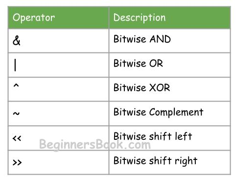
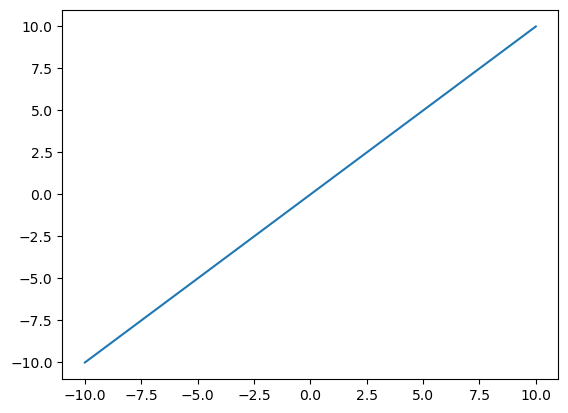
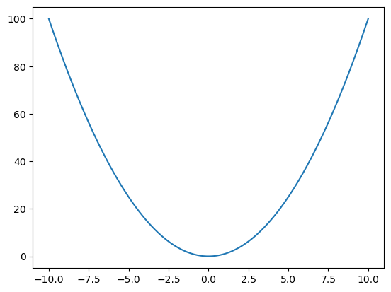
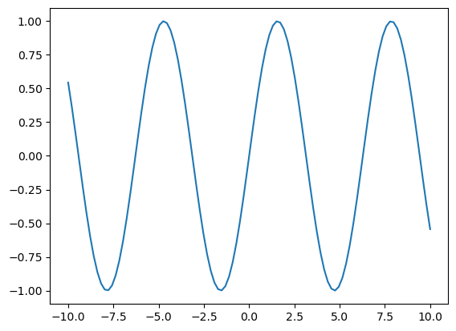
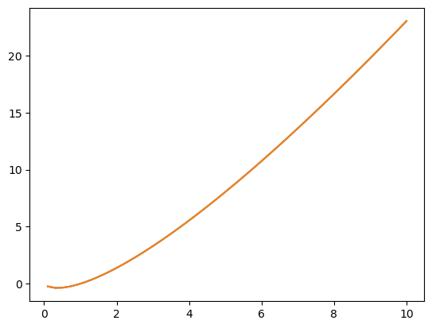
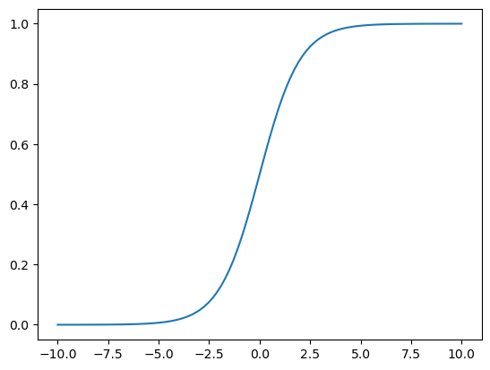

#### Bitwise operators are used in numpy 

# 

# Advanced Indexing


```python
import numpy as np
```


```python
a = np.arange(24).reshape(6,4)
a
```


    array([[ 0,  1,  2,  3],
           [ 4,  5,  6,  7],
           [ 8,  9, 10, 11],
           [12, 13, 14, 15],
           [16, 17, 18, 19],
           [20, 21, 22, 23]])


### Normal Indexing


```python
a[1,3]
```


    np.int64(7)


```python
a[1:3,2:4]
```


    array([[ 6,  7],
           [10, 11]])


# Fancy Indexing


```python
a[:,[0,2,3]]
```


    array([[ 0,  2,  3],
           [ 4,  6,  7],
           [ 8, 10, 11],
           [12, 14, 15],
           [16, 18, 19],
           [20, 22, 23]])


```python
a[[0,2,4],[1,2,3]]
```


    array([ 1, 10, 19])


```python
a[[0,2,3,5]]
```


    array([[ 0,  1,  2,  3],
           [ 8,  9, 10, 11],
           [12, 13, 14, 15],
           [20, 21, 22, 23]])


```python
a[:,[0,1,2]]
```


    array([[ 0,  1,  2],
           [ 4,  5,  6],
           [ 8,  9, 10],
           [12, 13, 14],
           [16, 17, 18],
           [20, 21, 22]])


when rows,cols slices are not equal

```python
a
```


    array([[ 0,  1,  2,  3],
           [ 4,  5,  6,  7],
           [ 8,  9, 10, 11],
           [12, 13, 14, 15],
           [16, 17, 18, 19],
           [20, 21, 22, 23]])


```python
a[[1,2,3]][:,[1,3]]
```


    array([[ 5,  7],
           [ 9, 11],
           [13, 15]])


# Boolean Indexing


```python
a = np.random.randint(0,100,24).reshape(6,4)
a
```


    array([[79, 88, 73,  5],
           [60, 35, 22, 47],
           [44, 59, 29, 10],
           [ 3, 36, 67, 89],
           [42, 71, 42, 20],
           [87,  7,  8, 58]], dtype=int32)


```python
a>50
```


    array([[ True,  True,  True, False],
           [ True, False, False, False],
           [False,  True, False, False],
           [False, False,  True,  True],
           [False,  True, False, False],
           [ True, False, False,  True]])


```python
a[a>50]
```


    array([79, 88, 73, 60, 59, 67, 89, 71, 87, 58], dtype=int32)


```python
a[a%2==0]
```


    array([88, 60, 22, 44, 10, 36, 42, 42, 20,  8, 58], dtype=int32)


```python
a[(a > 50) & (a % 2 == 0)]
```


    array([88, 60, 58], dtype=int32)


find all numbers not divisible by 7

```python
a[~(a%7==0)]
```


    array([79, 88, 73,  5, 60, 22, 47, 44, 59, 29, 10,  3, 36, 67, 89, 71, 20,
           87,  8, 58], dtype=int32)


# Broadcasting
The term broadcasting describes how NumPy treats arrays with different shapes during arithmetic operations.

The smaller array is “broadcast” across the larger array so that they have compatible shapes.

```python
a = np.arange(6).reshape(2,3)
b = np.arange(6,12).reshape(2,3)

print(a)
print(b)
print()
print(a+b)
```

    [[0 1 2]
     [3 4 5]]
    [[ 6  7  8]
     [ 9 10 11]]
    
    [[ 6  8 10]
     [12 14 16]]
    


```python
a = np.arange(6).reshape(2,3)
b = np.arange(13,19).reshape(2,3)
print(a,b)

print()
print(a-b)

```

    [[0 1 2]
     [3 4 5]] [[13 14 15]
     [16 17 18]]
    
    [[-13 -13 -13]
     [-13 -13 -13]]
    

#### Broadcasting Rules

**1. Make the two arrays have the same number of dimensions.**<br>
- If the numbers of dimensions of the two arrays are different, add new dimensions with size 1 to the head of the array with the smaller dimension.<br>

#### 
**2. Make each dimension of the two arrays the same size.**<br>
- If the sizes of each dimension of the two arrays do not match, dimensions with size 1 are stretched to the size of the other array.
- If there is a dimension whose size is not 1 in either of the two arrays, it cannot be broadcasted, and an error is raised.

#### 

## what we do is:
- we see one with rows,cols like (4,3)
- then we make me make the other (3) to (1,3)
- then, we make the 1 equal to 4 like: (1->4,3)
- now, we can perform 

###### 
**the working is** <br>
- below


```python
a = np.arange(12).reshape(4,3)
b = np.arange(3)

print(a)
print(b)
print("\nSum of two unequal arrays by broadcating:\n",a+b)
```

    [[ 0  1  2]
     [ 3  4  5]
     [ 6  7  8]
     [ 9 10 11]]
    [0 1 2]
    
    Sum of two unequal arrays by broadcating:
     [[ 0  2  4]
     [ 3  5  7]
     [ 6  8 10]
     [ 9 11 13]]
    

### The below is not performing b/c:
- we it make (1,3) but the other is (3,4)
- so the no.of rows is not matching
- as we know that we can change only when it contains 1
  


```python
a = np.arange(12).reshape(3,4)
b = np.arange(3)

print(a)
print(b)

print(a+b)
```

    [[ 0  1  2  3]
     [ 4  5  6  7]
     [ 8  9 10 11]]
    [0 1 2]
    


    ---------------------------------------------------------------------------

    ValueError                                Traceback (most recent call last)

    Cell In[20], line 7
          4 print(a)
          5 print(b)
    ----> 7 print(a+b)
    

    ValueError: operands could not be broadcast together with shapes (3,4) (3,) 


```python
a = np.arange(3).reshape(1,3)
b = np.arange(3).reshape(3,1)

print(a)
print(b)

print("\nIt become (3,3)",a+b)
```


```python
a = np.arange(3).reshape(1,3)
b = np.arange(4).reshape(4,1)

print(a)
print(b)

print(a + b)
```


```python
a = np.array([1])
# shape -> (1,1)
b = np.arange(4).reshape(2,2)
# shape -> (2,2)

print(a)
print(b)

print(a+b)
```


```python
a = np.arange(12).reshape(3,4)
b = np.arange(12).reshape(4,3)

print(a)
print(b)

print(a+b)
```


```python
a = np.arange(16).reshape(4,4)
b = np.arange(4).reshape(2,2)

print(a)
print(b)

print(a+b)
```

### Working with mathematical functions


```python
a = np.arange(10)
np.sin(a)
```

#### sigmoid


```python
def sigmoid(array):
  return 1/(1+np.exp(-array))


a = np.arange(100)

sigmoid(a)
```


    array([0.5       , 0.73105858, 0.88079708, 0.95257413, 0.98201379,
           0.99330715, 0.99752738, 0.99908895, 0.99966465, 0.99987661,
           0.9999546 , 0.9999833 , 0.99999386, 0.99999774, 0.99999917,
           0.99999969, 0.99999989, 0.99999996, 0.99999998, 0.99999999,
           1.        , 1.        , 1.        , 1.        , 1.        ,
           1.        , 1.        , 1.        , 1.        , 1.        ,
           1.        , 1.        , 1.        , 1.        , 1.        ,
           1.        , 1.        , 1.        , 1.        , 1.        ,
           1.        , 1.        , 1.        , 1.        , 1.        ,
           1.        , 1.        , 1.        , 1.        , 1.        ,
           1.        , 1.        , 1.        , 1.        , 1.        ,
           1.        , 1.        , 1.        , 1.        , 1.        ,
           1.        , 1.        , 1.        , 1.        , 1.        ,
           1.        , 1.        , 1.        , 1.        , 1.        ,
           1.        , 1.        , 1.        , 1.        , 1.        ,
           1.        , 1.        , 1.        , 1.        , 1.        ,
           1.        , 1.        , 1.        , 1.        , 1.        ,
           1.        , 1.        , 1.        , 1.        , 1.        ,
           1.        , 1.        , 1.        , 1.        , 1.        ,
           1.        , 1.        , 1.        , 1.        , 1.        ])


```python
def mean_squared_error(array,other):
    return np.mean((array-other)**2)

arr = np.random.randint(1,50,25)
arr1 = np.random.randint(1,50,25)

mean_squared_error(arr,arr1)
```


    np.float64(349.04)


```python
def BCE(actual,predicted):
    bce = -(actual*  np.log(predicted) + (1-actual) * np.log( 1 - predicted))
    return bce

BCE(arr,arr1)
```

    C:\Users\ziaah\AppData\Local\Temp\ipykernel_2804\513224118.py:2: RuntimeWarning: divide by zero encountered in log
      bce = -(actual*  np.log(predicted) + (1-actual) * np.log( 1 - predicted))
    C:\Users\ziaah\AppData\Local\Temp\ipykernel_2804\513224118.py:2: RuntimeWarning: invalid value encountered in log
      bce = -(actual*  np.log(predicted) + (1-actual) * np.log( 1 - predicted))
    


    array([ nan,  nan,  nan,  nan,  nan,  nan,  nan,  nan,  nan,  nan,  nan,
            nan,  nan,  nan, -inf,  nan,  nan,  nan,  nan,  nan,  nan,  nan,
            nan,  nan,  nan])


## Working With Missing Values
- nan


```python
import numpy as np
```


```python
a = np.array([1,2,3,4,np.nan,5])
a
```


    array([ 1.,  2.,  3.,  4., nan,  5.])


```python
a[np.isnan(a)]
```


    array([nan])


```python
a[~np.isnan(a)]

```


    array([1., 2., 3., 4., 5.])


# <br>Plotting Graphs Of Numpy


```python
import matplotlib.pyplot as plt
```


```python
x = np.linspace(-10,10,100)
y = x

plt.plot(x,y)
```


    [<matplotlib.lines.Line2D at 0x1f91fe93750>]


    

    


```python
x = np.linspace(-10,10,100)
y = x**2

plt.plot(x,y)
```


    [<matplotlib.lines.Line2D at 0x1f9217be350>]


    

    


```python
x = np.linspace(-10,10,100)
y= np.sin(x)
plt.plot(x,y)
plt.show()
```


    

    


```python
x = np.linspace(-10,10,100)
plt.plot(x,y)
y = x * np.log(x)
plt.plot(x,y)
plt.show()
```

    C:\Users\ziaah\AppData\Local\Temp\ipykernel_5180\3116787028.py:3: RuntimeWarning: invalid value encountered in log
      y = x * np.log(x)
    


    

    


```python
x = np.linspace(-10,10,100)
y = 1/(1+np.exp(-x))

plt.plot(x,y)
```


    [<matplotlib.lines.Line2D at 0x1f9218b1090>]


    

    


```python

```
